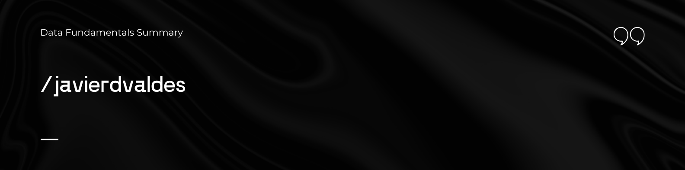
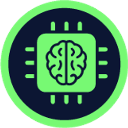

    

    <h1>Fundamentos de Data</h1>
    

## Introducción al documento

El siguiente resumen está basado en el curso de [Fundamentos de Data](https://platzi.com/cursos/ia-data-ml/) de la carrera Ingeniería de Datos de [Platzi](https://platzi.com). Una experiencia educativa centrada en el mundo de la manipulación y gestión de datos. 

En este curso comenzamos a entender una serie de temas fundamentales que forman parte integral de esta carrera, desglosando conceptos clave y aplicaciones prácticas. Este recorrido se enriquecerá con el uso de herramientas especializadas, como ChatGPT, Dall-E 2 y Hugging Face, que potenciarán tu aprendizaje. 
El curso está dictado por los prefesores [Carlos Alarcón](https://platzi.com/profes/alarcon7a/) y [Sílvia Ariza Sentís](https://platzi.com/profes/silari_/)

## Objetivos del documento

- Utiliza **recursos gratuito**s para trabajar con IA.
- Conoce cómo aprovechar la IA para tu **trabajo y vida personal.**
- Entiende el funcionamiento de **machine learning** y **deep learning.**
- Comprende qué es **IA** y su **impacto en el mundo.**

## Acceso al resumen
Click en el siguiente enlace👉 [Resumen Fundamentos de Data](summary.md)
